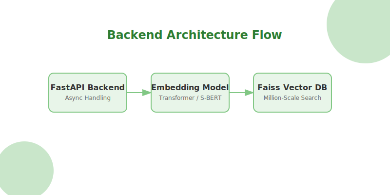

# NutriGenius — 智能食材 Agentic RAG 推荐系统 🥗

**基于两阶段检索增强生成 (RAG) 的下一代菜谱搜索引擎，深度理解你的食材，精准匹配你的健康目标。**

[](https://www.docker.com/) 
[](https://nextjs.org/)
[](https://fastapi.tiangolo.com/)
[](https://www.langchain.com/langgraph)

---

## 🌟 核心特性

- 🧠 **Agentic Reranking (两阶段 RAG)**：
  - **Stage 1**: 使用 FAISS 进行百万级数据的高速向量检索。
  - **Stage 2**: 使用定制 LLM Agent 对检索结果进行“生物自适应”重排序（基于你的增肌、减脂或清洁饮食目标）。
- 💬 **智能厨师对话 (LangGraph)**：不仅仅是搜索，AI 助手能以“厨师”身份陪你聊菜谱、改做法、建议搭配。
- 🔍 **视觉识别 (Google Vision)**：拍照识别食材，告别手动输入，一键寻找厨房灵感。
- 🧬 **健康自适应**：系统会根据你的 BMI、基础代谢和健身目标，动态调整推荐权重。

---

## 🏗️ 系统架构

本项目采用前后端分离的现代化架构，通过 Docker 实现一键交付。



---

## 🚀 一键部署 (Docker-First)

我们提供了完整的自动化部署脚本，确保在不同操作系统下都能“点一下就运行”。

### 1. 前置准备

- **Docker Desktop**：确保已安装并启动（支持 GPU 加速需安装 [NVIDIA Container Toolkit](https://docs.nvidia.com/datacenter/cloud-native/container-toolkit/install-guide.html)）。
- **模型文件**：`Qwen3-Embedding-0.6B`（请放置在本地 `/your/models/path` 下）。
- **静态数据**：`data/` 目录（包含清洗后的 Parquet 文件与 FAISS 索引）。
- **API Keys**：[Gemini API Key](https://aistudio.google.com/app/apikey) & [Supabase](https://supabase.com/).

### 2. 环境配置

复制模板并填写：
```bash
cp .env.example .env.local
```

| 变量名 | 说明 | 示例 |
| :--- | :--- | :--- |
| `MODEL_DIR` | **[必填]** 本地模型存放的父目录 | `D:/models` (Win) 或 `/home/user/models` (Linux) |
| `GOOGLE_API_KEY` | **[必填]** Gemini 模型的 API 秘钥 | `AIzaSy...` |
| `NEXT_PUBLIC_SUPABASE_URL` | **[必填]** Supabase 项目地址 | `https://xyz.supabase.co` |
| `HTTPS_PROXY` | **[可选]** 容器内访问 Google API 的代理 | `http://host.docker.internal:7897` |

### 3. 运行部署脚本

脚本会自动执行：Docker 检查 -> 环境校验 -> 数据文件校验 -> GPU/CPU 自动选择 -> 启动。

**Windows (PowerShell):**
```powershell
.\deploy.ps1
```

**Linux / macOS:**
```bash
chmod +x deploy.sh
./deploy.sh
```

---

## 🔌 深度配置：GPU 与 CPU 模式

默认情况下，项目以 **GPU 加速模式** 构建后端。

> [!TIP]
> **切换为 CPU 模式**：
> 如果你的设备没有 NVIDIA 显卡，请修改 `docker-compose.yml`：
> 1. 将 `build.args.BUILD_TYPE` 改为 `cpu`。
> 2. 注释掉 `deploy.resources` 部分。

---

## 🛠️ 常用开发命令

| 任务 | 命令 |
| :--- | :--- |
| **启动服务 (后台)** | `docker compose up -d` |
| **实时日志** | `docker compose logs -f` |
| **停止并清理** | `docker compose down` |
| **本地前端调试** | `pnpm dev` (访问 http://localhost:3000) |
| **本地后端调试** | `uvicorn recommender.main:app --port 8000` |

---

## 📂 数据目录 (Data Sync)

部署前请确保根目录下存在以下结构：

```text
data/
├── embeddings_0p6b/
│   ├── faiss_index.bin       # 向量索引
│   └── recipe_ids.npy        # ID 映射
└── processed/
    └── recipes_clean.parquet # 清洗后的原始菜谱数据
```

---

## 📚 扩展阅读

- [📘 系统设计说明书](docs/SYSTEM_DESIGN.md)：深入了解重排序算法与 Agent 逻辑。
- [📗 用户指南](docs/USER_GUIDE.md)：如何使用各功能模块。

---

> [!IMPORTANT]
> 本项目仅供学习和研究使用。由于模型推理较重，建议宿主机至少预留 8GB 内存。

<p align="center">Made with ❤️ for NutriGenius Community</p>
